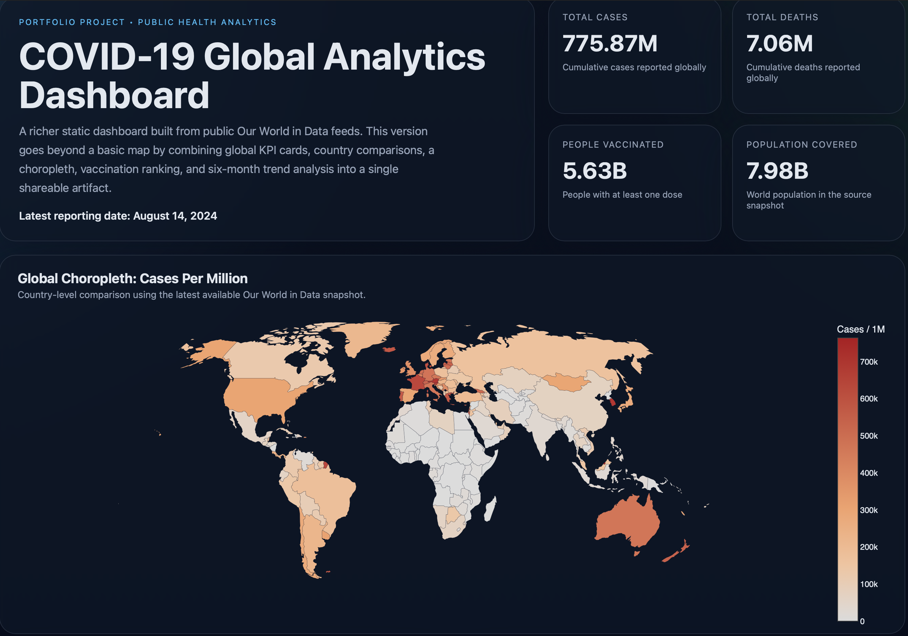

# COVID-19 Global Data Visualization

An advanced static analytics dashboard built on top of public Our World in Data COVID-19 datasets. The project now combines global KPI cards, a choropleth, country rankings, vaccination comparisons, and six-month trend charts into a single GitHub Pages-friendly artifact.

## Preview


## Highlights

- Pulls current global and country-level COVID-19 data from Our World in Data
- Builds a polished static dashboard suitable for GitHub Pages
- Includes global KPI cards for cases, deaths, vaccinations, and population
- Visualizes country-level burden with a choropleth map
- Compares top countries by total cases and vaccination coverage
- Tracks six months of smoothed new-case trends for selected countries
- Adds an exploratory scatter plot of cases vs deaths per million

## Tech Stack

- Python
- Pandas
- Plotly.js via CDN
- Jupyter Notebook

## Project Files

```text
covid-data-visualization/
├── covid_project.ipynb
├── script.py
├── covid_world_map.html
├── requirements.txt
└── README.md
```

## Run Locally

```bash
git clone https://github.com/Diksha159457/covid-data-visualization.git
cd covid-data-visualization
python3 -m venv .venv
source .venv/bin/activate
pip install -r requirements.txt
python script.py
```

The script regenerates `covid_world_map.html` using the latest dataset available from the source URL.

## Deployment

This repository includes a GitHub Pages workflow in `.github/workflows/deploy-pages.yml`.

- On every push to `main`, GitHub Actions publishes `covid_world_map.html` as a static site.
- Live site:
  `https://diksha159457.github.io/covid-data-visualization/`

## Resume Value

This project demonstrates data wrangling, dashboard storytelling, client-side chart rendering, and the packaging of analytics work into a polished public artifact that can be shared directly with recruiters.

## Future Improvements

- Add forecast overlays or rolling-average comparisons by region
- Allow country selection through query params or lightweight controls
- Snapshot the source dataset locally for fully reproducible historical builds

## License

MIT. See [LICENSE](LICENSE).
