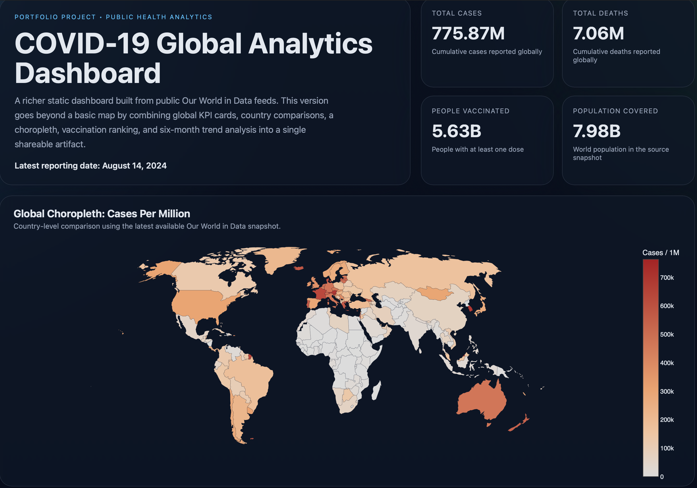

# COVID-19 Global Data Visualization

[](https://github.com/Diksha159457/covid-data-visualization/actions/workflows/ci.yml)
[](https://diksha159457.github.io/covid-data-visualization/)

An advanced static analytics dashboard built on top of public Our World in Data COVID-19 datasets. The project now combines global KPI cards, a choropleth, country rankings, vaccination comparisons, and six-month trend charts into a single GitHub Pages-friendly artifact.

## Preview


## Highlights

- Pulls current global and country-level COVID-19 data from Our World in Data
- Builds a polished static dashboard suitable for GitHub Pages
- Includes global KPI cards for cases, deaths, vaccinations, and population
- Visualizes country-level burden with a choropleth map
- Compares top countries by total cases and vaccination coverage
- Tracks six months of smoothed new-case trends for selected countries
- Adds an exploratory scatter plot of cases vs deaths per million

## Tech Stack

- Python
- Pandas
- Plotly.js via CDN
- Jupyter Notebook

## Project Files

```text
covid-data-visualization/
├── covid_project.ipynb
├── script.py
├── covid_world_map.html
├── requirements.txt
└── README.md
```

## Run Locally

```bash
git clone https://github.com/Diksha159457/covid-data-visualization.git
cd covid-data-visualization
python3 -m venv .venv && source .venv/bin/activate
pip install -r requirements-dev.txt

python script.py             # rebuild covid_world_map.html from the snapshot in data/
python script.py --refresh   # re-download sources, update data/, rebuild
pytest -q                    # 16 tests
```

## Reproducible data snapshot

The upstream sources (Our World in Data and `datasets/covid-19`) are archived and could disappear. A trimmed snapshot (about 140 KB) is versioned in `data/`, so the dashboard rebuilds identically without network access:

| File | Contents |
|---|---|
| `owid_latest.csv` | Latest per-country totals (OWID, last updated Aug 2024) |
| `vaccinations_last_reported.csv` | Each country's most recent fully-vaccinated rate and its date |
| `history_tracked.csv` | Daily confirmed cases for the five tracked countries (series ends Apr 2022) |

A test fails if the committed HTML doesn't match what the snapshot produces, and deployment only runs after the tests pass.

## Data fixes in this version

- **United States missing from the trend chart.** The history source names it `US`, so the "five countries" chart only showed four. Names are now mapped and a missing tracked country fails the build.
- **Vaccination leaders showed 0%.** OWID's *latest* file only holds values reported on its final date (6 of 234 countries), so 10 of the 12 "leaders" were shown at 0%. The chart now uses each country's last reported figure.
- **Unequal comparison.** The trend chart compared raw case counts between India (1.4B people) and the UK (67M). It now plots new cases per million.
- **Bubble chart.** China and India's bubbles covered the whole chart, and axes went negative. Bubble sizes are now capped and axes start at zero.
- **Safe embedding.** Data is embedded with `</` escaped (no `<script>` break-out) and NaN is rejected rather than emitting invalid JavaScript.

## Deployment

This repository includes a GitHub Pages workflow in `.github/workflows/deploy-pages.yml`.

- On every push to `main`, GitHub Actions publishes `covid_world_map.html` as a static site.
- Live site:
  `https://diksha159457.github.io/covid-data-visualization/`

## Resume Value

This project demonstrates data wrangling, dashboard storytelling, client-side chart rendering, and the packaging of analytics work into a polished public artifact that can be shared directly with recruiters.

## Future Improvements

- Add forecast overlays or rolling-average comparisons by region
- Allow country selection through query params or lightweight controls
- ~~Snapshot the source dataset locally for fully reproducible historical builds~~ ✅ done (`data/`)

## License

MIT. See [LICENSE](LICENSE).
